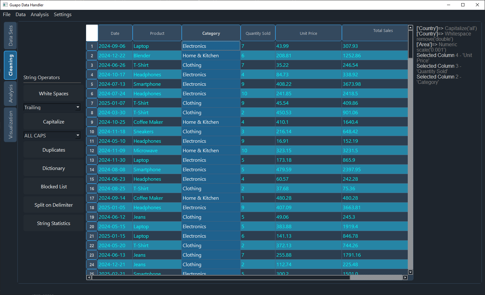
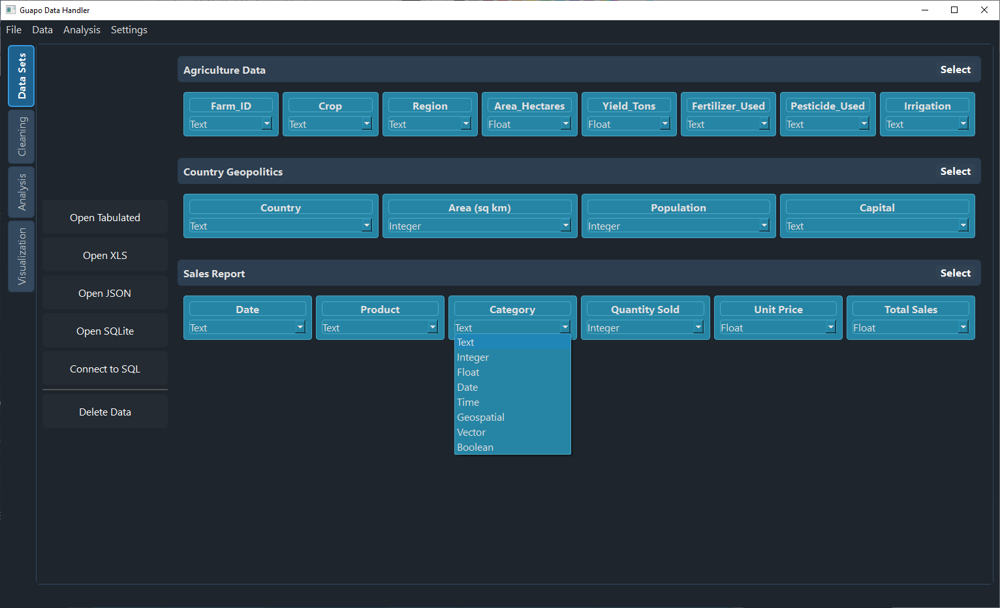

# Guapo
 A tool for data cleaning, handling, analysis and visualization. Work on numeric data, text, dates, geospatial data and more.

## Features
### Data Import ###
Accepts the following data types:
- CSV, TSV (or custom delimiter files)
- EXCEL (XLSX) (comming soon)
- JSON (comming soon)
- SQL (comming soon)
- KML (comming soon)

Automatic delimiter detection
Automatic data type and formatting detection
Library of custom data type formats

### Data Wrangling/Cleaning ###
Data inconsistency visualization
Missing or improperly formatted value detection
Rules validation
Blacklisted words
Data changes log
Detect outliers
Data splitting/merging

### Data Export ###
Can export to:
- CSV, TSV (or custom delimiter files) (comming soon)
- EXCEL (XLSX) (comming soon)
- JSON (comming soon)
- SQL (comming soon)
- KML (comming soon)

### Data Analysis ###
Data statistical summary
Data fitting

### Data Visualization ###
Different graph formats depending on data type.

## Dependencies
These dependencies are **not included** in this repository.

1. [PyQt6](https://pypi.org/project/PyQt6/)
2. [Pandas](https://pandas.pydata.org/)
3. [MatPlotLib](https://matplotlib.org/)
4. [Seaborn](https://seaborn.pydata.org/)
5. [NumPy](https://numpy.org/)

Please download and install these manually before running the project.

